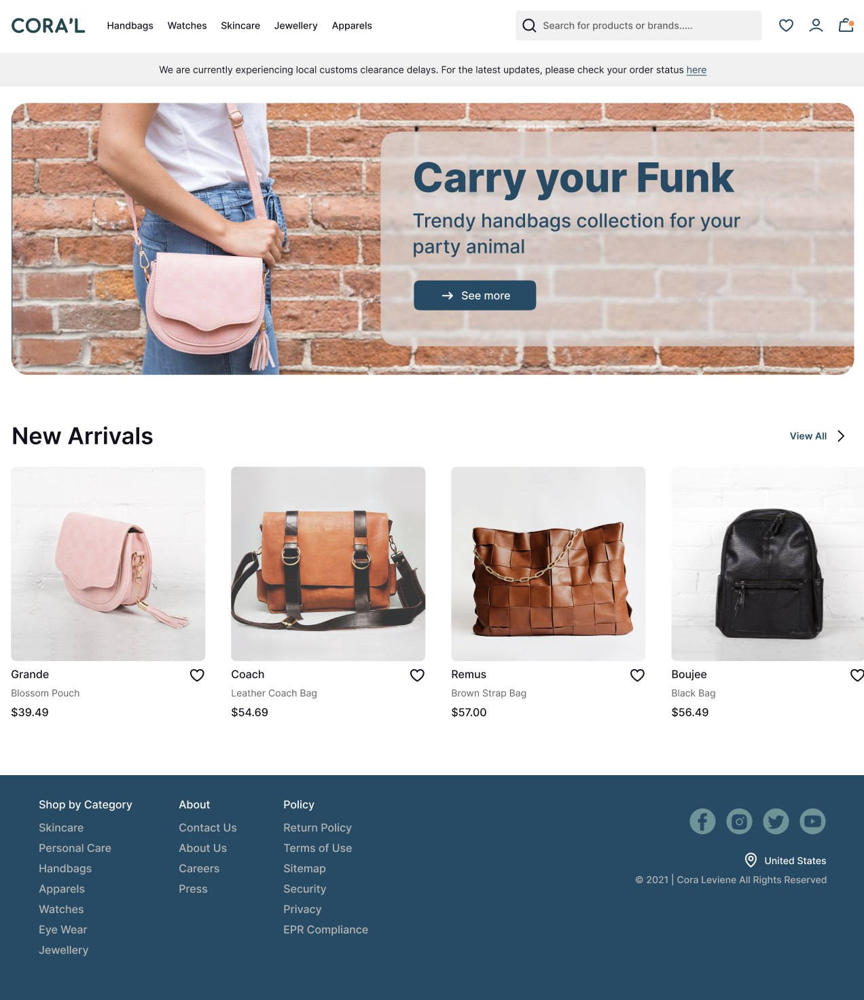
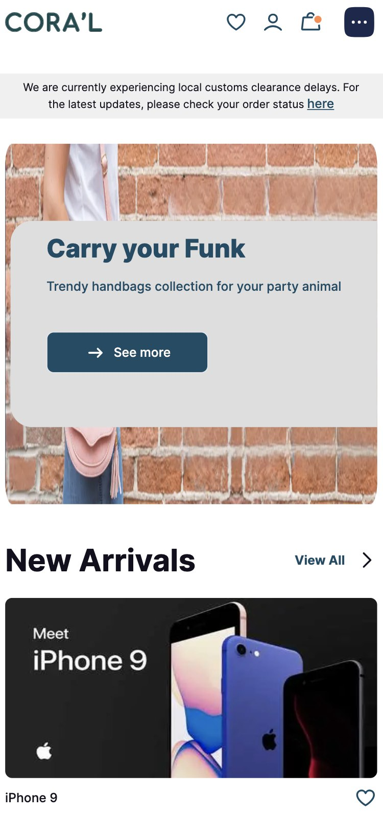

# Responsive Website React/Next (SSR)

## Start project

### Step 1

`npm install`

### Step 2

`npm run dev`

### Website Demo:

- UI - https://6554eb2a5edda12dce886387--radiant-cactus-f6f475.netlify.app/

[//]: # (![Responsive Desktop website]&#40;./public/images/desktop-full.png&#41;)

- Laptop version

- Mobile version

